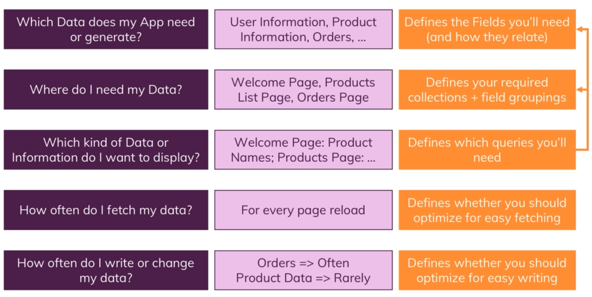
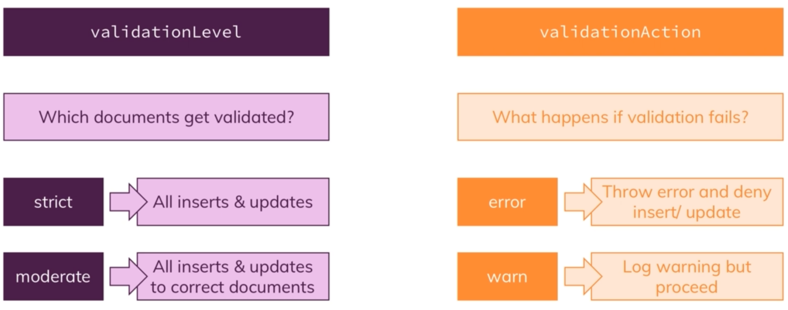
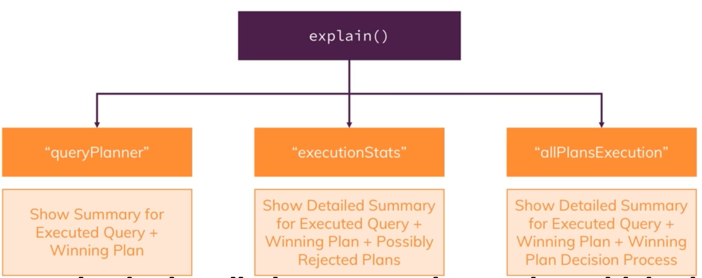
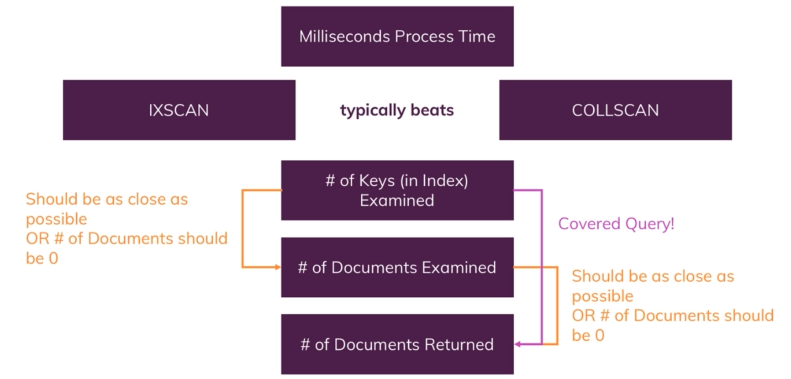
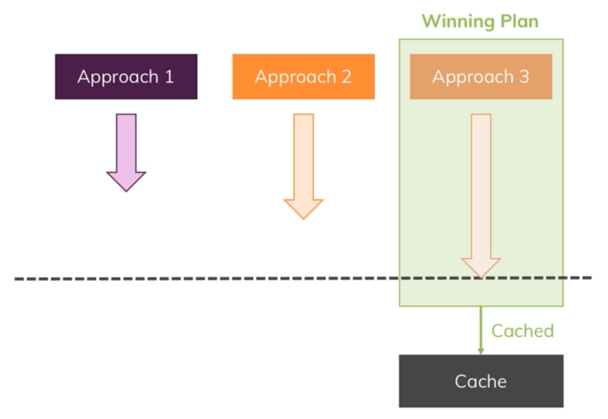

# MongoDB notes

## start

shows every db `show db`.  
select what db you want and `use db_name` to switch to db.

insert
db.products.insertOne({"name": "A Book", "price": 12.99})

## CRUD works

`db.flight.find({"name": "something"})`

this will print the flight with distance greater than 100.
because of the special `$gt` mongodb operator
`db.flight.find({"distance": {$gt: 100}})`
if you just want one element, you can use `findOne`
`db.flight.findOne({"distance": {$gt: 100}})`  

when query with `find`, the command return a *Cursor Object*

### Projection with find

There is always the time that you don't need all the data from the database,
so its logical to don't retrieve all of the data of an object to the application.
In this case we can use projection with find to select the key that we are
interested in or want to remove it form the data.  
`db.passengers.find({}, {"name": 1, "_id": 0})`  
with this query only the *name* field will return and all the other field in
the object will be omitted. with `"_id": 0` the default *_id* field will be
omitted from the find data.

### Insert(One|Many)

For insert one you just pass one document to be added to your collection
`db.persons.insertOne({"key": "value"})`. This will add a document to *persons* collection.  

For inserting more that one document you have to use *insertMany()* with an array of
document as the first argument.
`db.persons.insertMany([{"key": "value"}, {"key": "value}])`  

If you insert the a document with an *_id* that already exist in database, you get an
*duplicate key* error and the rest of the document in the array of insert many will not be
added to database. But this behavior can be changed with additional argument to insert method.
just pass the `{ordered: false}` so if a document in the array of document failed other will be added.  

Another useful argument is *writeConcern* which control how the data write to mongodb cluster disk
and journal. first arg in *writeConcern* is *w*, setting it to zero will not return any acknowledgement, `{w: 0}`.
the default is `{w: 1}` which return an a acknowledgement.
the second arg in *writeConcern* is for journal and it has three state *false*,*true* and *undefined*.
setting it to false `{j: false}` will skip the journaling for data. it's faster but in a case of a failure in the mongo server
after a restart the server will not be able to recover the data has not been written to database.  

Atomicity the whole operation done as whole or rollback, this will guaranties to not have partially inserted data if
an operation failed at the middle of it. for *insertMany()* this option applies to each document individually.
This Atomicity is only on **document lever**.

There is an *insert()* method but use other insert method, they are better!

### update(One|Many|O)

if you just need to update one object you can do it with
`updateOne` command like this:
`db.flightData.updateOne({"_id": ObjectId("aslkdfjas")}, {$set: {"delayed": true}})`.  
for updating many element in the database, use
`update` or `updateMany`. but the `update` has a different approach to update,
if `update` is used with the `$set` in the second object it would actually update
the first object and add the new fields to them, but with out the `$set` arg the `update` it will replace the object. for example:
`db.flightData.update({"_id": ObjectId("object_id")}, {"delayed": true}})`
**replace** the whole object with the second object in the `update` argument,
but in the case of `updateOne` and `updateMany` this would be rejected.

*if you really want to replace the object it's better to user the*
*`replace` method*
*`db.replaceOne({}, {}}`. it has the same effect as the update without*
*`$set` has.*  

Adding new fields in a document can be done with `$set` operator and this way we can even have nested document
`db.flightData.updateMany({}, {$set: {status: {"description": "on-time", "lastUpdate": "1 hour ago", "details": {"responsible": "Your Name"}}}})`  
and we will be end up with something like this.

**upsert**: you pass this a the third argument to update operation as
`db.col.updateOne({"name": "some"}, {$set: {age : 38}}, {upsert: true})`
and if the document does not exist in the collection, upsert will create one and add
all the fields in it.  

To push array of document to a array field you can use `$push`
`db.users.updateOne({name: "username"}, {$push: {hobbies: {$each: [{title: "Good Wine", frequency: 1}, {title: "Hiking", frequency: 2}]}, $sort: {frequency: -1}}})`
this will add this two hobbies to the user hobbies array and with the sort option we sort by frequency in descending order.
this sort option apply to the whole hobbies array and not just the new data. If we just want to add one document to the array we
should emit `$each` in the query.  
If you want to add a **unique** value to an array and prevent duplication you can use `$addToSet` instead of
`$push`.  

Now we are at it we can `pull` or `pop` element from the an array.
For *pulling* we can do this and pull all the element with the specified title.
`db.users.updateOne({name: "username"}, {$pull: {hobbies: {title: "something"}}})`


```javascript
{
"_id" : ObjectId("5f585a682be6d96ed523fe82"),
"aircraft" : "Airbus A320",
"intercontinental" : false,
"status" : {
 "description" : "on-time",
 "lastUpdate" : "1 hour ago",
 "details" : {
  "responsible" : "Your Name"
 }
}
}
```

or you can pass a list of data
`> db.passengers.updateOne({"name": "Albert Twostone"}, {$set: {hobbies: ["sport", "cooking"]}})`
and have an array in the object.

```javascript
{
"_id" : ObjectId("5f619bcec6576fc432eba30d"),
"name" : "Albert Twostone",
"age" : 68,
"hobbies" : [
 "sport",
 "cooking"
]
}
```


## Schemas

Things to consider when creating the schemas



### Relation

instead of embed the doc inside each other or

```javascript
{
    "user": "name",
    "favBooks": [{}, {}, {}]
}
```

we can referenced them by id

```javascript
{
    "user": "name",
    "favbook": ["id1", "id2"]
}
```

its acceptable to use embedded document for one-to-one relation. but in the case of relation
we define something to be our reference as id to find the document with it. 

In the case of one to many relation you can go both way too.  
for the relation you can go like this

```javascript
db.questionThreads.insertOne({"creator": "Max", "question": "How does that all works?", "answers": ["q1a1", "q1a2"]})
// and add the answers in a separate collection
db.answers.insertMany([{"_id": "q1a1", "text": "It works like that"}, {"_id": "q1a2", "text": "some stuff"}])
```

Same goal can be reached with embedded document and have all the answers in an array of object
in the answers.  

Now for many to many relation

```javascript
db.customers.insertOne({"name": "Max", "age": 29})
db.products.insertOne({"title": "A find book", "price": 12.99})
db.customers.updateOne({}, {$set: {"order": [{"productId": "ObjectId(129371232807)", "quantity": 2}]}})
```

With the last line we added a reference to the product id of the book in the customer document.  
You can add the order as a embedded doc, but this might not be good, but if you take a snapshot of data
when user order something it's a good idea to use embedded doc instead of referencing it.

## Schema validation

Schema validation can check the incoming data to see if it match the discribed schemas or not.

we can define a validator for posts collection like this

```javascript
db.createCollection('posts', {
  validator: {
    $jsonSchema: {
      bsonType: 'object',
      required: ['title', 'text', 'creator', 'comments'],
      properties: {
        title: {
          bsonType: 'string',
          description: 'must be a string and is required'
        },
        text: {
          bsonType: 'string',
          description: 'must be a string and is required'
        },
        creator: {
          bsonType: 'objectId',
          description: 'must be an objectid and is required'
        },
        comments: {
          bsonType: 'array',
          description: 'must be an array and is required',
          items: {
            bsonType: 'object',
            required: ['text', 'author'],
            properties: {
              text: {
                bsonType: 'string',
                description: 'must be a string and is required'
              },
              author: {
                bsonType: 'objectId',
                description: 'must be an objectid and is required'
              }
            }
          }
        }
      }
    }
  }
});

```

In a case where you need to update the existing collection with the validator
the command will change slightly and become like this.
it this command we change the *validatorAction* to *warn* so on validation exception
no insert or update fails and just warn the user.

```javascript
db.runCommand({
  collMod: 'posts',
  validator: {
    $jsonSchema: {
      bsonType: 'object',
      required: ['title', 'text', 'creator', 'comments'],
      properties: {
        title: {
          bsonType: 'string',
          description: 'must be a string and is required'
        },
        text: {
          bsonType: 'string',
          description: 'must be a string and is required'
        },
        creator: {
          bsonType: 'objectId',
          description: 'must be an objectid and is required'
        },
        comments: {
          bsonType: 'array',
          description: 'must be an array and is required',
          items: {
            bsonType: 'object',
            required: ['text', 'author'],
            properties: {
              text: {
                bsonType: 'string',
                description: 'must be a string and is required'
              },
              author: {
                bsonType: 'objectId',
                description: 'must be an objectid and is required'
              }
            }
          }
        }
      }
    }
  },
  validationAction: 'warn'
});

```

### Find

**Query** operator narrow downs the items that we get, ex : `$eq`  
query selector consist on *Comparison*, *Evaluation*, *Logical* and ...
`db.movies.find({$or: [{"rating.average": {$lt: 5}},{"rating.average": {$gt: 9.3}}]})`  
`db.movies.find({$and: [{genres: "Drama"}, {genres: "Horror"}])`  

this won't work if you want te get all the hobbies with title of sport and frequency fo 2 or higher
`db.users.find({$and: [{"hobbies.title": "Sports"}, {"hobbies.frequency": $gte: 2}}]})`  
there is a special operator for this
`db.users.find({hobbies: {$elemMatch: {title: "Sport", frequency: {$gt: 3}}}})`

**Projection** manipulate the data presentation to view, ex: `$`  
projection consist of `$`, `$elemMatch`, `$meta`.  

every field that is not included in the second argument is excluded with the exception of the find
which need to be excluded explicitly
`db.movies.find({}, {name: 1, genres:1, _id: 0})`  

If it is required to project based on array there is a *elemMatch* operation for that
`db.movies.find({"rating.average": {$gt: 9}}, {"genres": {$elemMatch: {$eq: "Horror"}}})`  

if a user has a list of hobbies and we want to match to hobbies with more that one condition,
writing them separately would match the what we want  
`db.users.find({"hobbies": {$elemMatch: {"title": "Sports", "frequency": {$gte: 2}}}}).count()`

**update** allow to modifying and adding new data to the collection, `$inc`  
in addition to above there are update operator like
fields and array  

To update a fields in all the array you need to use `$inc` method and some special way to update
all the element in array. take a look at this
`db.users.updateMany({totalAge: {$gt: 30}}, {$inc: {"hobbies.$[].frequency": -1}})`  
this query will reduce all the frequency in the hobbies array by one.  

so as this done. how to update a certain filed in a array doc.
this maybe: `db.users.updateMany({"hobbies.frequency": {$gt: 2}}, {$set: {"hobbies.goodFrequency": true}}`
nah, this will raise error because hobbies is an array and you can update array like this.  
or this: `db.users.updateMany({"hobbies.frequency": {$gt: 2}}, {$set: {"hobbies.$[].goodFrequency": true}}`
but this update all the element on the hobbies which we really don't want.  

we have to try something like this and address the element we want in the `$[el]`, by using *arrayFilters* in
the third argument to specify what el refer to in the **matched document**.
`db.users.updateMany({"hobbies.frequency": {$gt: 2}}, {$set: {"hobbies.$[el].goodFrequency": true}}, {arrayFilters: [{"el.frequency": {$gt: 2}}]})`

### Cursor Operation

this will sort items based on the average and runtime skip the first 100 doc and only return 10 of them remanding
if you miss the order of `sort`, `skip` and `limit` in the case of find mongodb will do them in the right order
`db.movies.find().sort({"rating.average": 1, "runtime": -1}).skip(100).limit(10)`

### aggregate

Aggregate is a way to join two collection document and merge them into one.
In here we use to find the author of the book from the *authors* collection and show them *as* creator in
a new aggregated document.

`db.books.aggregate([{$lookup: {from: "authors", localField: "authors", foreignField: "_id", as: "creator"}}])`

```javascript
{
    "_id": ObjectId(),
    "name": "My Book",
    "authors": [
        ObjectId(),
        ObjectId()
    ],
    "creators": [
        {
            "_id": ObjectId(),
            "name": ""
        },
        {
            "_id": ObjectId(),
            "name": ""
        }
    ]
}
```

## Delete(one|many)

`deleteOne` and `deleteMany` works with every query we provide, like the query we use in find to filter the result.
`deleteOne` only delete the first matching document but the `deleteMany` delete every matching document.  
`db.users.deleteMany({totalAge: {$exists: false}}, isSporty: true)`
will delete every users which don't have a *totalAge* field and the *isSporty* is true.  

if we want to delete all of the collection user *drop* method: `db.users.drop()`  
or delete the whole database: `db.DropDatabase()`

## Index

In a normal situation when we run a query like `db.users.find({name: "max"})` this will scan the whole document
to find the matching document. on a large collection this can take too much time complete.
on the other hand mongo can work with indexes, in our case if the *name* is indexed mongo will go to the index and
perform and *index search* instead of whole collection scan. index sort the document with the provided key as index
so mongo can go the query key faster then go the document from there.  

this will provide an overhead to the insert because every time the we *insert* something
to collection the index must be updated too.  

now to get some insight about the query we can attach it to an special function like this

```javascript
> db.contacts.explain("executionStats").find({"dob.age": {$gt: 60}})
  {
  "queryPlanner" : {
    "plannerVersion" : 1,
    "namespace" : "contactData.contacts",
    "indexFilterSet" : false,
    "parsedQuery" : {
      "dob.age" : {
        "$gt" : 60
      }
    },
    "winningPlan" : {
      "stage" : "COLLSCAN",
      "filter" : {
        "dob.age" : {
          "$gt" : 60
        }
      },
      "direction" : "forward"
    },
    "rejectedPlans" : [ ]
  },
  "executionStats" : {
    "executionSuccess" : true,
    "nReturned" : 1222,
    "executionTimeMillis" : 11,
    "totalKeysExamined" : 0,
    "totalDocsExamined" : 5000,
    "executionStages" : {
      "stage" : "COLLSCAN",
      "filter" : {
        "dob.age" : {
          "$gt" : 60
        }
      },
      "nReturned" : 1222,
      "executionTimeMillisEstimate" : 1,
      "works" : 5002,
      "advanced" : 1222,
      "needTime" : 3779,
      "needYield" : 0,
      "saveState" : 5,
      "restoreState" : 5,
      "isEOF" : 1,
      "direction" : "forward",
      "docsExamined" : 5000
    }
  },
  "serverInfo" : {
    "host" : "8d3e79be871c",
    "port" : 27017,
    "version" : "4.4.1",
    "gitVersion" : "ad91a93a5a31e175f5cbf8c69561e788bbc55ce1"
  },
  "ok" : 1
  }
```

the explain method shows who many way mongo can run the query and what is the selected plan for running it.
with *executionStats` we will have more info about how the query would run and how much times it took to finish.
with this information in hand we can create indexes and observe how it effect the performance of our queries.  

```javascript
> db.contacts.createIndex({"dob.age": 1})
{
  "createdCollectionAutomatically" : false,
  "numIndexesBefore" : 1,
  "numIndexesAfter" : 2,
  "ok" : 1
}
// and drop index with
> db.contacts.dropIndex ({"dob.age": 1})

```

with crated index in hand, now our queries on "dob.age" runs much faster and takes less time to finish.

```javascript
db.contacts.explain("executionStats").find({"dob.age": {$gt: 60}})
{
  "queryPlanner" : {
    "plannerVersion" : 1,
    "namespace" : "contactData.contacts",
    "indexFilterSet" : false,
    "parsedQuery" : {
      "dob.age" : {
        "$gt" : 60
      }
    },
    "winningPlan" : {
      "stage" : "FETCH",
      "inputStage" : {
        "stage" : "IXSCAN",
        "keyPattern" : {
          "dob.age" : 1
        },
        "indexName" : "dob.age_1",
        "isMultiKey" : false,
        "multiKeyPaths" : {
          "dob.age" : [ ]
        },
        "isUnique" : false,
        "isSparse" : false,
        "isPartial" : false,
        "indexVersion" : 2,
        "direction" : "forward",
        "indexBounds" : {
          "dob.age" : [
            "(60.0, inf.0]"
          ]
        }
      }
    },
    "rejectedPlans" : [ ]
  },
  "executionStats" : {
    "executionSuccess" : true,
    "nReturned" : 1222,
    "executionTimeMillis" : 6,
    "totalKeysExamined" : 1222,
    "totalDocsExamined" : 1222,
    "executionStages" : {
      "stage" : "FETCH",
      "nReturned" : 1222,
      "executionTimeMillisEstimate" : 0,
      "works" : 1223,
      "advanced" : 1222,
      "needTime" : 0,
      "needYield" : 0,
      "saveState" : 1,
      "restoreState" : 1,
      "isEOF" : 1,
      "docsExamined" : 1222,
      "alreadyHasObj" : 0,
      "inputStage" : {
        "stage" : "IXSCAN",
        "nReturned" : 1222,
        "executionTimeMillisEstimate" : 0,
        "works" : 1223,
        "advanced" : 1222,
        "needTime" : 0,
        "needYield" : 0,
        "saveState" : 1,
        "restoreState" : 1,
        "isEOF" : 1,
        "keyPattern" : {
          "dob.age" : 1
        },
        "indexName" : "dob.age_1",
        "isMultiKey" : false,
        "multiKeyPaths" : {
          "dob.age" : [ ]
        },
        "isUnique" : false,
        "isSparse" : false,
        "isPartial" : false,
        "indexVersion" : 2,
        "direction" : "forward",
        "indexBounds" : {
          "dob.age" : [
            "(60.0, inf.0]"
          ]
        },
        "keysExamined" : 1222,
        "seeks" : 1,
        "dupsTested" : 0,
        "dupsDropped" : 0
      }
    }
  },
  "serverInfo" : {
    "host" : "8d3e79be871c",
    "port" : 27017,
    "version" : "4.4.1",
    "gitVersion" : "ad91a93a5a31e175f5cbf8c69561e788bbc55ce1"
  },
  "ok" : 1
  }
```

Keep in mind that index scan can sometime be slower than a full document scan. if the query returns the majority
of the document then index scan overhead for retrieving the actual document will be much higher than the matching scan.
in this case the full scan would return the result faster.  

*Compound Index* use to create index with multiple fields.  
`db.contacts.createIndex({"dob.age": 1, gender: 1})` create an index with multiple values.
the order of index in this case in `dob.age_1_gender_1`, it means that mongodb first sort based on the
`dob.age` and the based on `gender`. with this index we can search for `{"dob.age": 43, "gender": "male}`
or `{"dob.age": 41}` and the order of the fields does not matter. but we can't search for `gender` with this
index, because all the fields are sorted by `dob.age` and then `gender`. searching for `gender` will be a collection scan.
and for this query we have index like this.

```json
{
  "v" : 2,
  "key" : {
    "dob.age" : 1,
    "gender" : 1
  },
  "name" : "dob.age_1_gender_1"
}
```

indexes and sorting  
with `dob.age_1_gender_1` we can query for `dob.age` and sort on `gender` of course this won't any computation for sorting
as it's already sorted in the index. this is very helpful for huge collection. mongodb only allow 32 MB of memory for sorting and
if our query for sort is bigger the only way is to create index and query on the index to get the sorted values.


indexes support *unique* values. the default `_id` index has it. this *unique* index we can check if the *collection* has
any duplicate value or prevent duplication on insert. to create a *index* with *unique* properties run this.  
`db.contacts.createIndex({"email": 1}, {"unique": true})`. this query will throw an error if there is any duplicate value for
index key.  

*Partial Filter* only index the collection on a subset of document and ignore the cases that don't match the filter expression.
`db.contacts.createIndex({"dob.age": 1}, {partialFilterExpression: {gender: "male}})` this index query case all the males to be
inserted to index and querying on the age and male gender will be faster.
partial filter has the benefits of faster insert document insert and smaller index size on disk, because we do not create index
for the overall collection. the created index looks like this.

```json
{
  "v" : 2,
  "key" : {
    "dob.age" : 1
  },
  "name" : "dob.age_1",
  "partialFilterExpression" : {
    "gender" : "male"
  }
}
```

Keep in mind that query for `dob.age` alone won't go to the *partial filter* and we have to specify `{gender: "male"}` for this
query to run on index.

and for `db.contacts.explain().find({"dob.age": 60})` the winning plan is *COLLSCAN* cause there are females with age of 60!

```json
{
  "queryPlanner" : {
    "plannerVersion" : 1,
    "namespace" : "contactData.contacts",
    "indexFilterSet" : false,
    "parsedQuery" : {
      "dob.age" : {
        "$eq" : 60
      }
    },
    "queryHash" : "7E1734A1",
    "planCacheKey" : "EA07C72B",
    "winningPlan" : {
      "stage" : "COLLSCAN",
      "filter" : {
        "dob.age" : {
          "$eq" : 60
        }
      },
      "direction" : "forward"
    },
    "rejectedPlans" : [ ]
  },
  "serverInfo" : {
    "host" : "2ac5675d8a11",
    "port" : 27017,
    "version" : "4.4.1",
    "gitVersion" : "ad91a93a5a31e175f5cbf8c69561e788bbc55ce1"
  },
  "ok" : 1
}
```

but when we include male gender in the query `db.contacts.explain().find({"dob.age": 60, gender: "male"})`
the winner is *IXSCAN*.

```json
{
  "queryPlanner" : {
    "plannerVersion" : 1,
    "namespace" : "contactData.contacts",
    "indexFilterSet" : false,
    "parsedQuery" : {
      "$and" : [
        {
          "dob.age" : {
            "$eq" : 60
          }
        },
        {
          "gender" : {
            "$eq" : "male"
          }
        }
      ]
    },
    "queryHash" : "6602FE25",
    "planCacheKey" : "0EBB13B2",
    "winningPlan" : {
      "stage" : "FETCH",
      "filter" : {
        "gender" : {
          "$eq" : "male"
        }
      },
      "inputStage" : {
        "stage" : "IXSCAN",
        "keyPattern" : {
          "dob.age" : 1
        },
        "indexName" : "dob.age_1",
        "isMultiKey" : false,
        "multiKeyPaths" : {
          "dob.age" : [ ]
        },
        "isUnique" : false,
        "isSparse" : false,
        "isPartial" : true,
        "indexVersion" : 2,
        "direction" : "forward",
        "indexBounds" : {
          "dob.age" : [
            "[60.0, 60.0]"
          ]
        }
      }
    },
    "rejectedPlans" : [ ]
  },
  "serverInfo" : {
    "host" : "2ac5675d8a11",
    "port" : 27017,
    "version" : "4.4.1",
    "gitVersion" : "ad91a93a5a31e175f5cbf8c69561e788bbc55ce1"
  },
  "ok" : 1
  }
```

## Indexing and unique

With indexing we can add uniqueness for a fields, but adding including fields in the documents is optional.
with that said if we create and index oon a fields and some try to add more that on
document with the indexed filed missing we will het *duplicate key error*,
to resolve this issue we need to tell mongo to only unique if such a fields exists.

```shell
db.users.createIndex({email: 1}, {unique: true, partialFilterExpression: {email: {$exist: true}}})
```

## TTL Index

using this trigger the document to be deleted at certain amount of time after they are created.
this is help full when we are managing temporary data like cache and session and they need to be deleted
after sometimes passes.
the *TTL* feature only work on *single fields* index and not on *compound* fields.

```shell
db.sessions.createIndex({createdAt: 1}, {expiredAfterSeconds: 10})
```

every element added to `sessions` collection will be remove after 10 seconds.

## Query Diagnosis and Query Planning





### Covered Query

in the normal circumstance after an index scan mongo must examine the document and
return the document from the index keys. but in some cases (*Covered Query*) the intermediate
state is not needed. when we query and index and only want the value from that index `{id: 0, index_field: 1}`
mongo doesn't need to look at the document.

## Explain query plan

Every query we run on mongodb server, it consider many different plans for running the query.
suppose we have three different way of running a same query. mongodb will run the query on different plans
for a limited number of document in the collection (ex: 100 document). the winning plan get cached for that query.
the next time we run the same query mongo will choose that winning plan as the it cached before.  

of course winning plan for the time being is not going to be the winning plan for the future when the number of
document change or ... . so mongodb only change this for certain amount of time.
if insert many document (ex: 1000 doc) to a collection, create or delete and index or restart the server
our cached plan will be lost.


this is how a winning plan get chose

## Indexing on array

```json
{
  "name": "Max",
  "hobbies": [
    "Cooking",
    "flying"
  ],
  "addresses": [
    {
      "street": "Main street"
    },
    {
      "street": "Second street"
    }
  ]
}
```

with this document schema we can create index on `hobbies` *array of fields* or
`addresses` *array of documents*. when creating index on array document we must specify
the field we want to create the index on. ex: `addresses.street`, running `db.col.createIndex({"addresses": 1})`
will create index on the `addresses` document itself and of course mongo will not use *index scan* for
`db.col.find({"addresses.street": "some name"})` query.  

Creating index on arrays will make indexes larger than normal field index, for each element in the array
mongo create new index and every document has more than one item in its arrays fields.

## Text Index

Text can be index too for searching throw text fields, of course there is regex for searching text,
but it's slow.

```javascript
db.coll.createIndex({"description": "text"})
// in case of multiple fields in a document
db.coll.createIndex({"title": "text", "description": "text"})
```

in text index all the stem words (a, an, the) removed and it's not case sensitive.
there could be only one text index per collection, text index are heavy in size
and we can't create more that one for a collection.

searching for a text index is as follow

```javascript
// search in text index for every words
db.coll.find({$text: {$search: "some_text"}})
// phrase as a whole
db.coll.find({$text: {$search: "\"some text\""}})
```

when matching word with text index it is crucial to sort document based on an score that they match the query.
for this reason we have another option in the query.

```javascript
// this will add a score field to each document that show document matching score
db.products.find({$text: {$search: "some text"}}, {score: {$meta: "textScore"}})
// to sort based on the above
db.products.find({$text: {$search: "some text"}}, {score: {$meta: "textScore"}}).sort(
  {score: {$meta: "textScore"}}
)
```

when creating text index we can have additional infomation with it like language and weights of each field.
with weight we specify which fields should have higher score in the text query

```javascript
db.product.createIndex({title: "text", desciption: "text"}, {default_language: "english", weights: {title: 1, description: 10}})
```

### exclude a test in text index search

For excluding certain text from a text search we can search the word with a `-` as prefix.

```javascript
db.coll.find({$text: {$search: "searchthis -notsearchthis"}})
```
